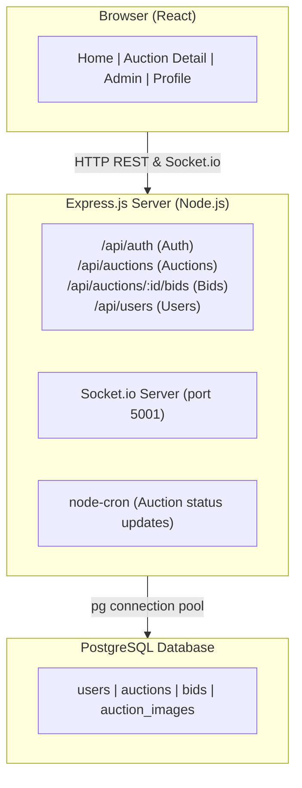
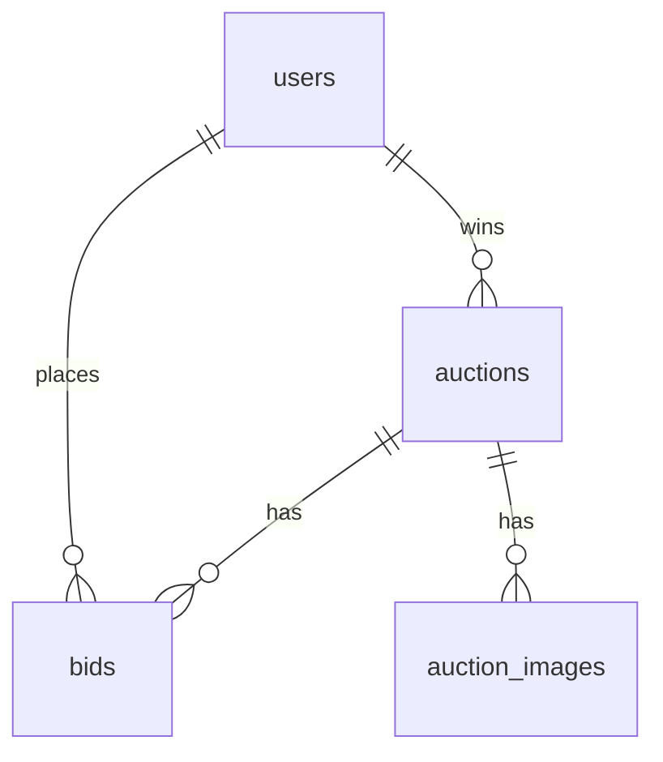
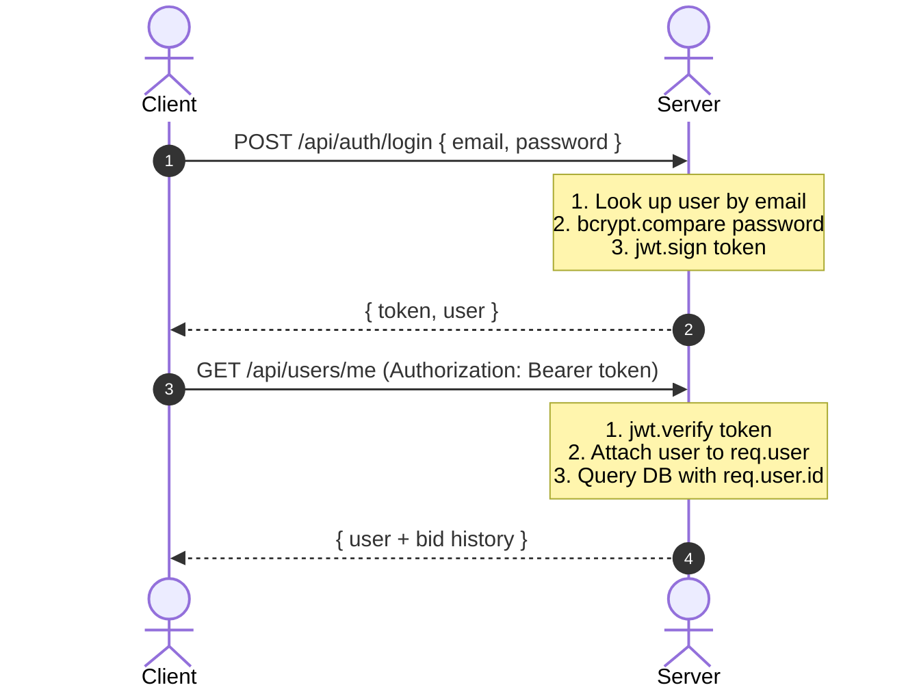
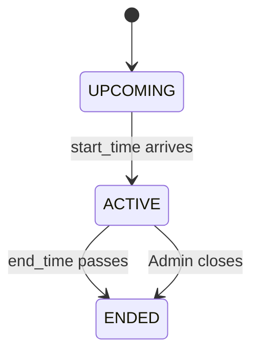

# Architecture & Design Document

## Bike Auction Platform — MTech Internship Assignment

---

## 1. Overview

A web application where registered users can browse and bid on used motorcycles in live auctions. Admins can create and manage auctions. The focus was on keeping things simple, readable, and working — not over-engineering.

---

## 2. System Architecture



**No microservices. No message queues. One server, one database, one frontend.**

---

## 3. Database Design

### Entity-Relationship Summary



### Tables

#### `users`
| Column | Type | Notes |
|--------|------|-------|
| id | SERIAL PK | |
| name | VARCHAR(100) | |
| email | VARCHAR(150) UNIQUE | |
| password_hash | VARCHAR(255) | bcrypt, cost 10 |
| role | VARCHAR(10) | 'user' or 'admin' |
| created_at | TIMESTAMP | default NOW() |

#### `auctions`
| Column | Type | Notes |
|--------|------|-------|
| id | SERIAL PK | |
| title | VARCHAR(200) | e.g. "2019 RE Classic 350" |
| year | INT | bike year |
| make | VARCHAR(100) | brand |
| model | VARCHAR(100) | model name |
| mileage | INT | in km |
| condition | VARCHAR(20) | excellent/good/fair/poor |
| description | TEXT | free-form text |
| starting_bid | DECIMAL(12,2) | minimum opening bid |
| current_bid | DECIMAL(12,2) | null if no bids yet |
| status | VARCHAR(20) | upcoming/active/ended |
| start_time | TIMESTAMP | when bidding opens |
| end_time | TIMESTAMP | when bidding closes |
| winner_id | INT FK → users | set when auction ends |
| created_by | INT FK → users | admin who created it |
| created_at | TIMESTAMP | |

#### `bids`
| Column | Type | Notes |
|--------|------|-------|
| id | SERIAL PK | |
| auction_id | INT FK → auctions | |
| user_id | INT FK → users | |
| amount | DECIMAL(12,2) | bid amount |
| created_at | TIMESTAMP | |

#### `auction_images`
| Column | Type | Notes |
|--------|------|-------|
| id | SERIAL PK | |
| auction_id | INT FK → auctions | CASCADE delete |
| url | VARCHAR(500) | direct image URL |
| display_order | INT | 0 = cover photo |

### Indexes
```sql
CREATE INDEX idx_bids_auction_id ON bids(auction_id);
CREATE INDEX idx_auctions_status ON auctions(status);
```
These two cover the most frequent queries: fetching bids for an auction, and filtering auctions by status.

---

## 4. Backend Design

### Folder Structure
```
backend/
├── index.js       ← Express app setup, all middleware, starts server
├── db.js          ← pg Pool instance (shared across all route files)
├── middleware.js  ← requireAuth + requireAdmin (JWT verification)
├── cron.js        ← node-cron job for auction status transitions
├── schema.sql     ← SQL to create all tables
└── routes/
    ├── auth.js      ← POST /auth/register, POST /auth/login
    ├── auctions.js  ← GET/POST/PUT /auctions, POST /auctions/:id/close
    ├── bids.js      ← GET/POST /auctions/:id/bids
    └── users.js     ← GET /users/me
```

### Authentication Flow



**Token format:** Standard JWT, 24-hour expiry, payload = `{ id, email, role }`

### Auction Status Machine



The cron job (`cron.js`) runs every minute and:
1. Finds all `active` auctions where `end_time <= NOW()` → marks them `ended`, sets `winner_id`
2. Finds all `upcoming` auctions where `start_time <= NOW()` → marks them `active`

### Bid Validation (Server-Side)

All of these are checked on the server, even if the frontend already validated:

1. Auction must exist
2. Auction status must be `active`
3. Bid amount must be greater than `current_bid` (or `starting_bid` if no bids yet)
4. User cannot bid if they are already the highest bidder

---

## 5. Frontend Design

### Folder Structure
```
frontend/src/
├── App.jsx        ← BrowserRouter + Routes + AuthContext
├── main.jsx       ← ReactDOM.createRoot entry
├── api.js         ← All fetch calls in one place
├── index.css      ← All styles (no CSS modules, no Tailwind)
├── pages/
│   ├── Home.jsx           ← Auction grid + search + filter tabs
│   ├── AuctionDetail.jsx  ← Detail + bidding + bid history
│   ├── Login.jsx
│   ├── Register.jsx
│   ├── Profile.jsx        ← User's bid history (compacted to highest bid per auction)
│   ├── AdminDashboard.jsx ← Stats + auction table + actions
│   ├── CreateAuction.jsx  ← Auction creation form
│   └── EditAuction.jsx    ← Edit upcoming auction form
└── components/
    ├── Navbar.jsx          ← Nav with conditional links based on role
    ├── AuctionCard.jsx     ← Card shown in the grid
    └── CountdownTimer.jsx  ← Ticks down every second using setInterval
```

### State Management

No Redux or Zustand — just React's built-in `useState` and `useContext`.

- **`AuthContext`** (in `App.jsx`) — holds `user` object and `login`/`logout` functions. Persists to `localStorage`.
- **Local state** per page — each page manages its own loading/error/data state. Simple and clear.

### Real-time Updates (WebSockets)

On the Auction Detail page:
- When a user views an auction, a Socket.io WebSocket connection is established.
- The user is added to a socket room corresponding to the auction's ID (`join_auction`).
- When a new bid is placed successfully on the backend, a `new_bid` event is broadcast to all users in the room.
- The client receives this event and instantly refreshes the active bids list and countdown timer.

This enables a true real-time bidding experience with minimal latency.

### Route Protection

```jsx
<Route path="/profile" element={user ? <Profile /> : <Navigate to="/login" />} />
<Route path="/admin"   element={user?.role === 'admin' ? <AdminDashboard /> : <Navigate to="/" />} />
```

Client-side redirect only — all API routes also check auth on the backend.

---

## 6. API Design

Base URL: `/api`

### Authentication
| Method | Endpoint | Auth | Description |
|--------|----------|------|-------------|
| POST | `/auth/register` | No | Creates user, returns JWT |
| POST | `/auth/login` | No | Verifies credentials, returns JWT |

### Auctions
| Method | Endpoint | Auth | Description |
|--------|----------|------|-------------|
| GET | `/auctions` | No | List all auctions. Query: `?status=active&search=royal` |
| GET | `/auctions/:id` | No | Full detail: specs + images + bids |
| POST | `/auctions` | Admin | Create auction |
| PUT | `/auctions/:id` | Admin | Update (only if status=upcoming) |
| POST | `/auctions/:id/close` | Admin | Manually end an active auction |

### Bids
| Method | Endpoint | Auth | Description |
|--------|----------|------|-------------|
| GET | `/auctions/:id/bids` | No | Bid history, sorted by amount desc |
| POST | `/auctions/:id/bids` | User | Place a new bid |

### Users
| Method | Endpoint | Auth | Description |
|--------|----------|------|-------------|
| GET | `/users/me` | User | Profile + all bids placed by user |

---

## 7. Security

| Concern | Approach |
|---------|----------|
| Passwords | bcrypt with cost factor 10 |
| Auth tokens | JWT, 24h expiry, checked on every protected route |
| Admin routes | Separate `requireAdmin` middleware checks `role === 'admin'` |
| SQL injection | Parameterized queries via pg (`$1, $2...` placeholders) |
| Bid tampering | All bid rules validated on the server (not just client) |
| CORS | Configured to only allow frontend origin via `FRONTEND_URL` env var |

---

## 8. Key Design Decisions

### Why PostgreSQL over MongoDB?
Auctions, bids, and users are relational by nature. Bids always reference a user and an auction. SQL joins make fetching bid history with user names trivial. The data has fixed, well-known shapes — no need for MongoDB's flexibility.

### Why WebSockets over polling?
To ensure premium user experience and true real-time bidding, we implemented WebSockets (Socket.io). While polling introduces latency, WebSockets push bids instantly to all users viewing the page, allowing competitive last-second bidding and preventing unnecessary database query overhead from constant polling.

### Why JWT in localStorage?
httpOnly cookies are safer against XSS but add complexity (CSRF protection needed). For this project's scope and demo environment, localStorage is fine and simpler. The PRD explicitly mentions this trade-off.

### Why image URLs instead of file uploads?
File uploads would require configuring disk storage or Cloudinary. URL inputs work fine for demo purposes and keep setup simple.

### Why one server?
Microservices would be over-engineering for a system expected to handle ~50 concurrent users. One Express server is easier to deploy, debug, and understand.
